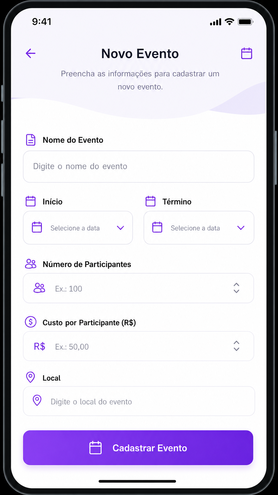
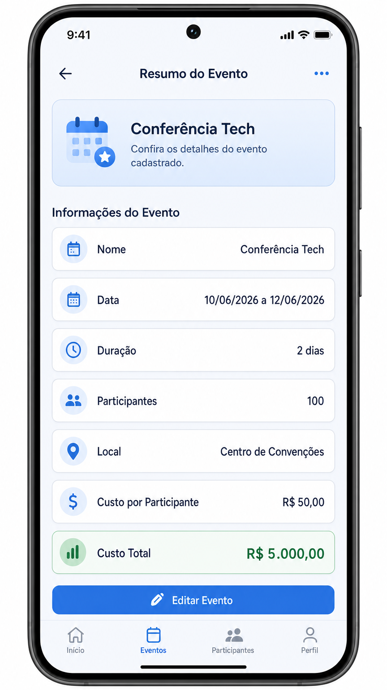

# Relatório de Desenvolvimento: Aplicativo de Cadastro de Eventos (.NET MAUI)

**Desenvolvido por:** Manus AI
**Data:** 31 de Maio de 2026

## 1. Visão Geral do Projeto
Este projeto consiste em um aplicativo desenvolvido utilizando o framework **.NET MAUI**, focado no cadastro e gerenciamento de informações básicas de eventos. O sistema permite a entrada de dados, realiza cálculos automáticos de duração e custos, e apresenta um resumo detalhado para o usuário.

## 2. Requisitos Implementados
Conforme solicitado, o projeto abrange os seguintes pontos:
- **Modelagem de Dados:** Classe `Evento` com propriedades para nome, datas, participantes, local e custos.
- **Lógica de Negócio:** Cálculo de duração em dias (`DateTime` e `TimeSpan`) e custo total.
- **Interface do Usuário:** Telas de Cadastro e Resumo utilizando **Data Binding**.
- **Navegação:** Transição entre páginas enviando o objeto de dados.

## 3. Capturas de Tela (Mockups)

### 3.1. Tela de Cadastro de Eventos
A tela inicial permite ao usuário inserir todas as informações necessárias para o evento. O design é focado na usabilidade e clareza.

### 3.2. Tela de Resumo do Evento
Após o cadastro, o usuário é direcionado para esta tela, onde todos os dados são exibidos de forma formatada, incluindo os cálculos automáticos.

## 4. Estrutura do Código
O código-fonte está organizado seguindo as melhores práticas do .NET MAUI:
- `Models/Evento.cs`: Contém a lógica de cálculo e notificações de mudança de propriedade.
- `Views/CadastroEventoPage.xaml`: Definição visual da tela de entrada de dados.
- `Views/ResumoEventoPage.xaml`: Definição visual da tela de exibição de resultados.

## 5. Repositório no GitHub
O projeto completo, incluindo todos os arquivos de configuração e código-fonte, está disponível no link abaixo:
[https://github.com/Ryper36/EventosApp](https://github.com/Ryper36/EventosApp)
