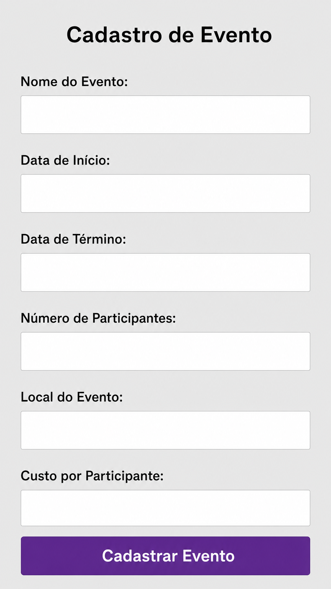
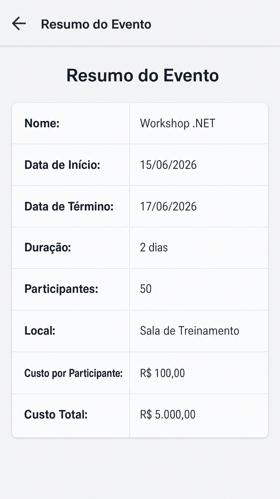

# Relatório de Projeto: Cadastro de Eventos (.NET MAUI)

**Data:** 31 de Maio de 2026
**Tecnologia:** .NET 8 MAUI

## 1. Descrição
Este projeto implementa um sistema de cadastro de eventos utilizando o framework .NET MAUI. A aplicação demonstra o uso de **Data Binding**, lógica de negócios com **DateTime** e **TimeSpan**, e navegação entre páginas.

## 2. Requisitos Atendidos
- **Modelagem:** Classe `Evento` com propriedades reativas (`INotifyPropertyChanged`).
- **Cálculos:** Duração calculada via `TimeSpan` e custo total baseado no número de participantes.
- **Interface:** Telas definidas em XAML com estilos globais.
- **BindingContext:** Associação direta entre a Model e a View.

## 3. Interfaces do Usuário (Telas do App)

### 3.1. Cadastro de Evento
Interface para entrada de dados do evento, com campos validados e seletores de data.

### 3.2. Resumo do Evento
Exibição dos dados processados, incluindo os cálculos automáticos de duração e custo total.

## 4. Repositório
O código-fonte completo está disponível em:
[https://github.com/Ryper36/EventosApp](https://github.com/Ryper36/EventosApp)
