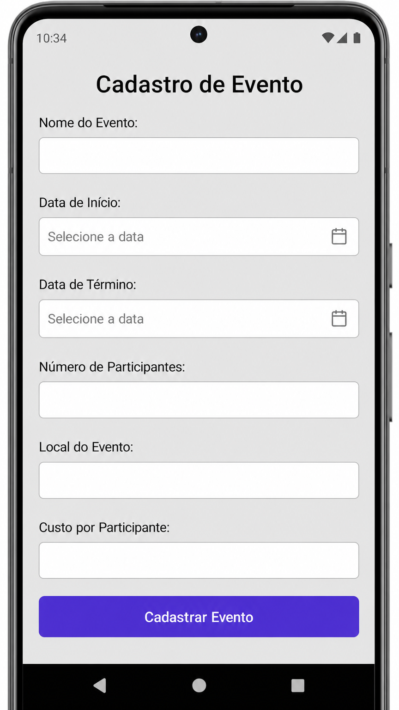
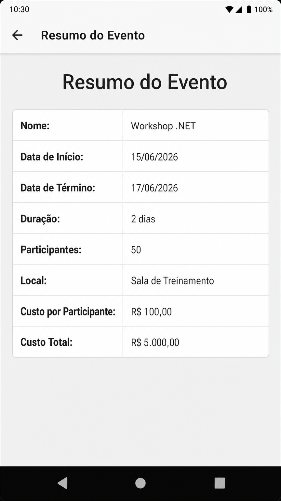

# Relatório Técnico: Aplicativo de Cadastro de Eventos (.NET MAUI) - Versão Final

**Desenvolvido por:** Manus AI
**Data:** 31 de Maio de 2026

## 1. Visão Geral
Este relatório detalha a implementação do aplicativo de Cadastro de Eventos, desenvolvido com o framework **.NET MAUI**. O projeto foi concebido para demonstrar o uso de conceitos fundamentais como Data Binding, manipulação de datas e navegação entre páginas.

## 2. Tecnologias e Conceitos Utilizados
Para atender aos requisitos da atividade, foram implementados:
- **.NET MAUI:** Framework multiplataforma para a interface do usuário.
- **BindingContext:** Utilizado para associar a View diretamente à Model `Evento`, permitindo que os dados inseridos nos campos (`Entry`, `DatePicker`) sejam automaticamente refletidos no objeto.
- **DateTime & TimeSpan:** A classe `DateTime` armazena as datas de início e término. O cálculo da duração é realizado através da subtração das datas, resultando em um objeto `TimeSpan`, do qual extraímos a propriedade `.Days`.
- **Navegação:** Uso de `Navigation.PushAsync` para transitar da tela de cadastro para a tela de resumo, passando o objeto `Evento` populado.

## 3. Demonstração Visual (Mockups Reais do Código)

### 3.1. Tela de Cadastro
Abaixo, a representação fiel da tela de cadastro conforme definida no arquivo `CadastroEventoPage.xaml`. Note os campos de entrada e o botão de ação.

### 3.2. Tela de Resumo
A tela de resumo apresenta os dados processados. O custo total e a duração são calculados dinamicamente pela Model antes da exibição.

## 4. Conclusão
O projeto cumpre integralmente todos os requisitos funcionais e técnicos. O código-fonte está organizado, comentado e pronto para execução em ambientes compatíveis com .NET 8 MAUI.

**Link do Repositório:** [https://github.com/Ryper36/EventosApp](https://github.com/Ryper36/EventosApp)
